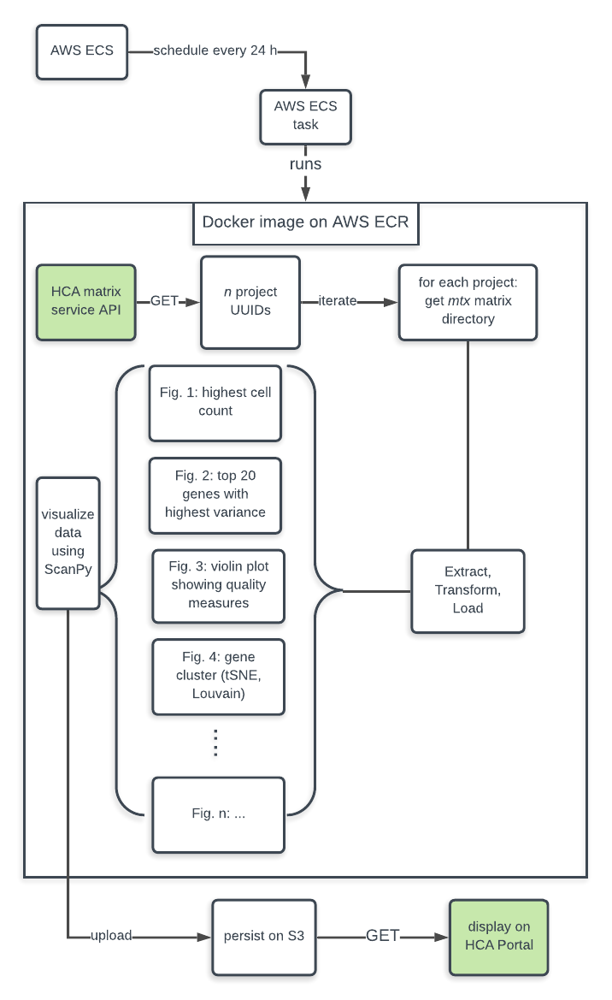

# data-portal-summary-stats

The service generates per-project summary figures. The service updates daily by running 
a Docker container on AWS Fargate. Figures are persisted on AWS S3. The general
architecture is as follows:


 

## Build Docker container
To build a Docker container that runs `data-portal-summary-stats` create a directory that you
name for instance `build`, then copy all relevant files from the project root into `build`:
```bash
.
├── data_portal_summary_stats.py
├── Dockerfile
├── requirements.txt
└── src
    ├── matrix_summary_stats.py
    ├── runner.py
    ├── settings.py
    └── utils.py

1 directory, 7 files
```


Docker commands need to be run in sudo mode for security reasons. You can avoid this by adding
 the user to the docker group, see [here](https://linoxide.com/linux-how-to/use-docker-without-sudo-ubuntu/))
 Next navigate to the `build` directory, prepared as explained in the previous paragraph, and
 execute:
```bash
docker build --tag=data-portal-summary-stats:<tag #> .
```
where `tag #` denotes a dot version of the build (e.g., `0.1`).
## Running `data-portal-summary-stats` Docker container

The code in `data_portal_summary_stats` needs to access AWS resources, so you need to pass your AWS
 credentials to container run. Suppose your credentials are in the usual subdirectory `~/.aws` 
 in your home directory, and they contain a profile named `my-profile`. In that case mount that 
 subdirectory as a volume inside the container, and set the environment variable with the default 
 profile like so:
```bash
docker run -v /home/michael/.aws:/root/.aws -e AWS_DEFAULT_PROFILE=my-profile \
       data-portal-summary-stats:<tag #> --environ dev --source fresh --blacklist true
```
The three arguments, `--environ`, `--source`, and `--blacklist` and their values follow the name 
of the image and its tag. 

### Blacklisting matrix files of specific project IDs
By _blacklisting_ we mean to exclude matrix files from the processing. `data-portal-summary-stats`
will request a list of all available matrix files of projects. Some of those files might be 
 too large to be processed with the current version. The argument 
 `--blacklist` is a temporary solution for such matrix files. To use the feature create a file 
 named `blacklist`. For each matrix file that empirically has been found to be too large to be
 processed, add its project ID to this file, following the style of one project ID per line, 
 without any delimiters. Then upload the file `blacklist` to the S3 bucket of the corresponding
 deployment environment. One way to upload it is:
 ```bash
 export AWS_DEFAULT_PROFILE=my_profile
 aws s3 cp blacklist s3://my_bucket/ 
```
where _my_bucket_ is the bucket name of the deployment environment.  